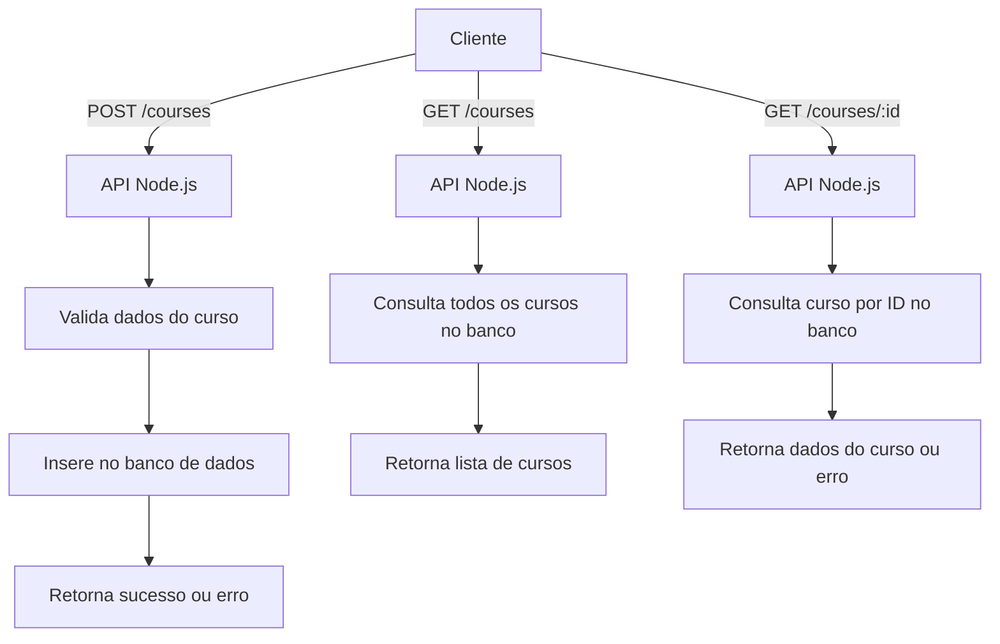

# API Node.js

Este projeto é uma API desenvolvida em Node.js com TypeScript, utilizando Drizzle para gerenciamento de banco de dados e Docker para facilitar o ambiente de desenvolvimento.

## Funcionalidades
- Gerenciamento de cursos
- Rotas para criação e consulta de cursos
- Integração com banco de dados via Drizzle ORM

## Estrutura do Projeto
```
docker-compose.yml         # Configuração de containers Docker
package.json              # Dependências e scripts do Node.js
tsconfig.json             # Configuração do TypeScript
drizzle.config.ts         # Configuração do Drizzle ORM
server.ts                 # Ponto de entrada da aplicação
src/
  database/
    client.ts             # Cliente de conexão com o banco de dados
    schema.ts             # Definição dos esquemas do banco de dados
  routes/
    create-course.ts      # Rota para criar cursos
    get-courses.ts        # Rota para listar cursos
    get-courses-by-id.ts  # Rota para buscar curso por ID
```

## Pré-requisitos
- Node.js >= 18
- Docker (opcional, para ambiente containerizado)

## Instalação
1. Clone o repositório:
   ```sh
   git clone <url-do-repositorio>
   ```
2. Instale as dependências:
   ```sh
   npm install
   ```
3. Configure as variáveis de ambiente conforme necessário.

## Executando a Aplicação
### Localmente
```sh
npm run dev
```

### Com Docker
```sh
docker-compose up --build
```

## Endpoints Principais
- `POST /courses` - Cria um novo curso
- `GET /courses` - Lista todos os cursos
- `GET /courses/:id` - Busca um curso pelo ID


## Diagrama de Fluxo Principal




